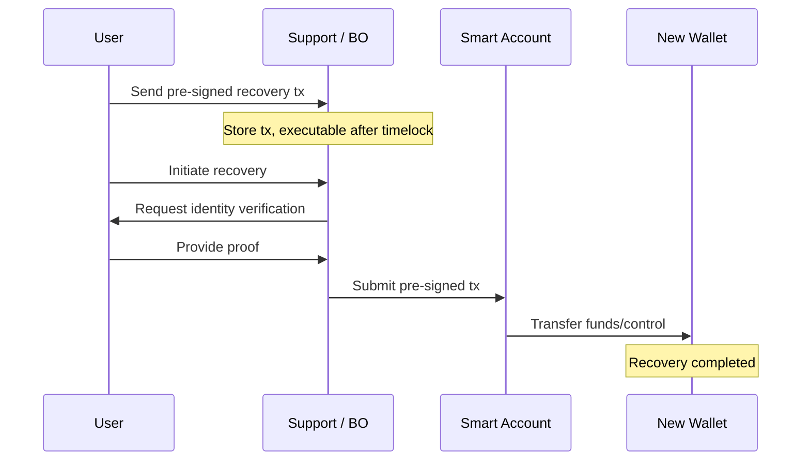
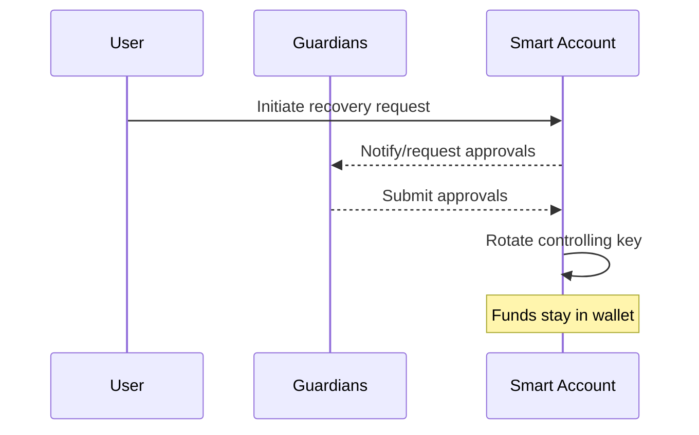

Recovery exists for the scenario where the user cannot reproduce the primary secret used for wallet control. This can happen when key derivation relies on noisy inputs (biometrics/visual keys) and the inputs change beyond what the extractor can tolerate.

While key derivation failures are expected to be rare, a robust embedded wallet design includes recovery mechanisms that preserve self-custody.

## Recovery goals

A good recovery mechanism should:

- Restore access without undermining self-custody.
- Be hard to abuse (by attackers or insiders).
- Be understandable to end users.
- Be enforceable (preferably on-chain).

## What recovery does: transfer vs rekey

There are two common recovery outcomes:

1. **Transfer-based recovery:** funds (or control) move to a new destination.
2. **Rekey-based recovery:** the wallet stays put; only the controlling key is rotated.

## Choosing a mechanism

| Mechanism | What changes | Strengths | Trade-offs |
|---|---|---|---|
| Timelocked fallback transfer | Funds/control transfer after delay | Works even with zero guardians | Introduces “assisted recovery” ops + compliance surface; funds temporarily leave wallet |
| Social recovery (guardians) | Control key rotates | Funds stay in wallet; no single party controls recovery | Coordination risk; guardian compromise/collusion needs mitigation |

In practice, many products support both, using guardians as the primary safety net and timelocked fallback as a last resort.

---

## Option 1: Timelocked fallback transfer (assisted recovery)

### Summary

At wallet setup, the user signs a pre-signed recovery transaction that is not submitted immediately. The backend stores it and can only submit it after a timelock (e.g., 90 days) and after a manual identity verification process.

A reference UX flow typically includes:

- A clear explanation (“you sign a recovery transaction; it’s not submitted now”).
- A validity window (e.g., “valid for 90 days”).
- A “review & sign” step that highlights “all funds” and “not submitted now.”
- A passkey-confirmed action (“Confirm using passkey”).

### Sequence

### Key considerations

- The platform does not need the user's private keys to execute this flow.
- The platform cannot execute before the timelock.
- The user should be able to regenerate/rotate the fallback transaction while they still have access (invalidating older artifacts).
- This mechanism is subject to policy, legal, and compliance review.

---

## Option 2: Social recovery (guardians)

### Summary

The smart account is configured with a set of guardians (trusted accounts). Recovery requires approvals from a configurable threshold (e.g., 2-of-3, 3-of-5). After threshold approval, the wallet rekeys to a new controlling key derived from the user's new embedded wallet.

A reference UX flow typically includes:

- Selecting guardians (trusted contacts).
- Choosing a threshold (e.g., 2-of-3).
- A recovery screen that shows approval status and allows canceling the request.

### Sequence

### Key considerations

- No single guardian (or platform party) can unilaterally take control when thresholds are used.
- Funds do not leave the wallet during recovery; only the controlling key rotates.
- Security increases with more diverse guardians, but coordination becomes harder.
- Guardian compromise/collusion remains a residual risk; mitigate with thresholds, delays, and monitoring.
