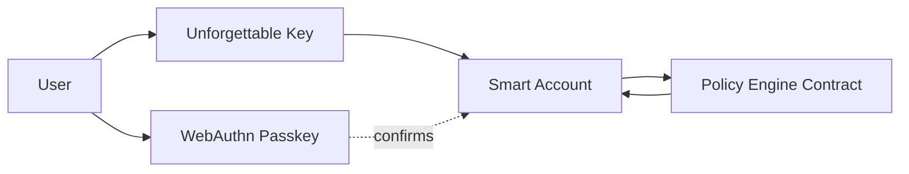

A Smart Account is the on-chain smart-contract wallet used by Unforgettable Embedded Wallets. It holds user assets and enforces programmable rules on-chain and is controlled the Unforgettable Key.

The Smart Account supports account abstraction patterns such as gasless (sponsored) transactions, batched execution, and custom validation logic via ERC-4337.

## Action authorization flow

At a high level, an action is executed only when all required checks pass:

1. **Unforgettable Key** authorizes the action (user’s primary control).
2. **Policy Engine** approves it (rules, limits, recovery constraints).
3. **Passkey confirmation** is required for specific high-impact configuration steps.

