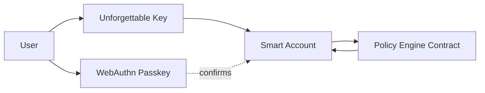

A Smart Account is the on-chain smart-contract wallet used by Unforgettable Embedded Wallets. It holds user assets and enforces programmable rules on-chain, while day-to-day control comes from the Unforgettable Key, a private key the user can re-derive on-device from their chosen factors.

The Smart Account supports account abstraction patterns such as gasless (sponsored) transactions, batched execution, and custom validation logic via ERC-4337.

## The three building blocks

### 1) Control: the Unforgettable Key

The Unforgettable Key is the primary signer that controls the Smart Account.

Instead of persisting a seed phrase, the key is re-derived client-side when needed from user-chosen factors (e.g., face/object scans, optional password/PoW). The Smart Account treats signatures from this key as the user's authorization.

**Why this matters**

* No seed phrase UX.
* The key is available on any device where the user can reproduce the factors.
* The wallet remains self-custodial because the user can always derive the key again.

### 2) Rules: the Policy Engine contract

The Policy Engine is a separate on-chain module that defines *what the wallet is allowed to do*.

The Smart Account "connects" to the Policy Engine by consulting it during validation/execution (implementation details vary by account framework, but conceptually: Smart Account asks Policy Engine if an action is allowed).

Typical policy controls include:

* **Spending rules:** allowlists/denylists, per-tx limits, per-day limits.
* **Recovery rules:** timelocks, guardian thresholds, cooldowns.
* **Operational constraints:** required confirmations for sensitive actions, mandatory delays for high-risk transitions.
* **Account abstraction constraints:** rules that apply to batched calls, sponsored-gas execution, or specific paymaster/forwarder configurations.

This keeps rules centralized and auditable instead of being scattered across UI and backend code.

See: [Module: Policy Engine](./policy-engine)

### 3) Confirmation: WebAuthn passkeys for sensitive actions

For actions that change security posture, you should require an explicit user presence + intent check via WebAuthn passkeys.

Passkeys are not meant to replace the Unforgettable Key for normal transaction signing. They are a confirmation layer used when the user is:

* Enabling/disabling recovery.
* Changing recovery settings (timelocks, guardians, thresholds).
* Regenerating/rotating recovery artifacts.
* Downgrading security policies.
* Changing gas sponsorship / relayer settings (anything that affects how transactions can be executed).

See: [Module: Passkeys](./passkeys)

## How the Smart Account makes decisions

At a high level, an action is executed only when all required checks pass:

1. **Unforgettable Key** authorizes the action (user’s primary control).
2. **Policy Engine** approves it (rules, limits, recovery constraints).
3. **Passkey confirmation** is required for specific high-impact configuration steps.

