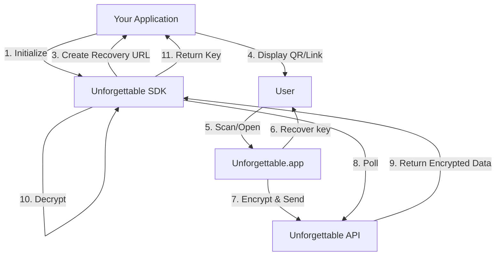
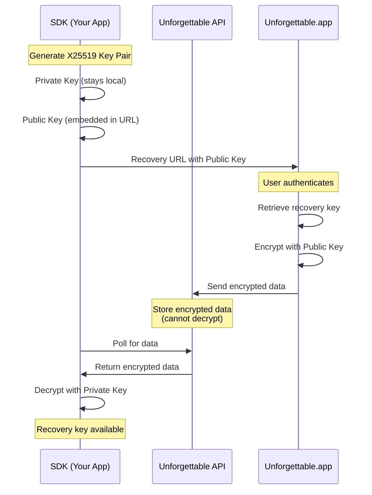
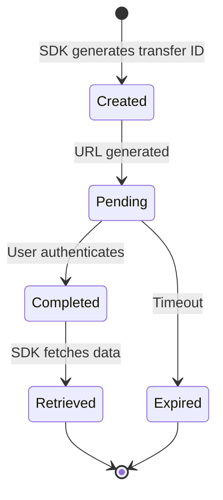

# Architecture Overview

Understand the high-level architecture and design principles of the Unforgettable SDK.

## System Architecture



## Components

### 1. Your Application

Your application integrates the SDK and is responsible for:
- Initializing the SDK with appropriate parameters
- Displaying the recovery URL (as QR code or link)
- Handling the recovered private key
- Creating/restoring user wallets or accounts

### 2. Unforgettable SDK

The client-side SDK running in your application that:
- **Generates Cryptographic Keys**: Creates an X25519 key pair for secure communication
- **Builds Recovery URLs**: Composes URLs with embedded parameters
- **Polls for Data**: Periodically checks the API for recovered keys
- **Decrypts Data**: Decrypts the recovered key using the private key

### 3. Unforgettable.app

The web application where users complete the recovery process:
- Parses recovery URL parameters
- Authenticates users with selected factors (Face, Image, Password)
- Retrieves the stored recovery key from secure storage
- Encrypts the key with the public key from the URL
- Sends encrypted data to the API

### 4. Unforgettable API

The backend service that:
- Acts as a temporary encrypted data transfer mechanism
- Stores encrypted recovery keys (cannot decrypt them)
- Serves encrypted data to the SDK upon request
- Implements rate limiting and security measures

## Security Model

### End-to-End Encryption



**Key Points:**
- The API never has access to decryption keys
- Private keys never leave the originating device
- Even if API is compromised, data remains encrypted

### Data Flow

1. **Setup Phase**
   - SDK generates ephemeral X25519 key pair
   - Public key embedded in recovery URL
   - Private key stored in memory (never persisted)

2. **Recovery Phase**
   - User authenticates on Unforgettable.app
   - App encrypts recovery key with SDK's public key
   - Encrypted data sent to API with unique transfer ID

3. **Retrieval Phase**
   - SDK polls API with transfer ID
   - Receives encrypted data
   - Decrypts using private key
   - Returns plaintext recovery key to application

## Design Principles

### 1. Zero-Trust Architecture

- No component can access unencrypted recovery keys except the endpoints
- API is an untrusted intermediary
- Cryptographic guarantees over operational security

### 2. Separation of Concerns

```
┌─────────────────────────────────────────────────────────────┐
│ Application Layer                                           │
│ - Business logic                                            │
│ - Wallet management                                         │
│ - User interface                                            │
└─────────────────────────────────────────────────────────────┘
                          ↓
┌─────────────────────────────────────────────────────────────┐
│ SDK Layer                                                   │
│ - Cryptography                                              │
│ - URL generation                                            │
│ - API communication                                         │
└─────────────────────────────────────────────────────────────┘
                          ↓
┌─────────────────────────────────────────────────────────────┐
│ Protocol Layer                                              │
│ - HTTP/HTTPS transport                                      │
│ - JSON serialization                                        │
│ - Error handling                                            │
└─────────────────────────────────────────────────────────────┘
```

### 3. Stateless SDK

- Each SDK instance is independent
- No persistent storage required
- Fresh encryption key pair for each recovery session
- Prevents key reuse vulnerabilities

### 4. Fail-Safe Defaults

- Secure defaults for all configurations
- Explicit opt-in for permissive settings
- Timeout mechanisms prevent indefinite waiting
- Clear error messages for debugging

## Recovery Factors

The SDK supports multiple [recovery factors](../api/recovery-factors.md). Applications can specify which factors to support:

```typescript
// Multiple factors
factors: [RecoveryFactor.Face, RecoveryFactor.Image, RecoveryFactor.Password]

// Single factor
factors: [RecoveryFactor.Face]

// No factors specified (user chooses from all available)
factors: []
```

## Data Transfer Protocol

### Transfer Lifecycle



### Transfer States

1. **Created**: Transfer ID generated, waiting for URL to be shared
2. **Pending**: URL shared, waiting for user to complete factors
3. **Completed**: User completed factors, encrypted data available
4. **Retrieved**: SDK successfully fetched and decrypted data
5. **Expired**: Transfer exceeded time-to-live (TTL)

## Next Steps

- [Encryption Details](/sdk/advanced/encryption) - Deep dive into cryptography
- [Data Transfer](/sdk/advanced/data-transfer) - API communication details
- [URL Generation](/sdk/advanced/url-generation) - URL parameter specifications
