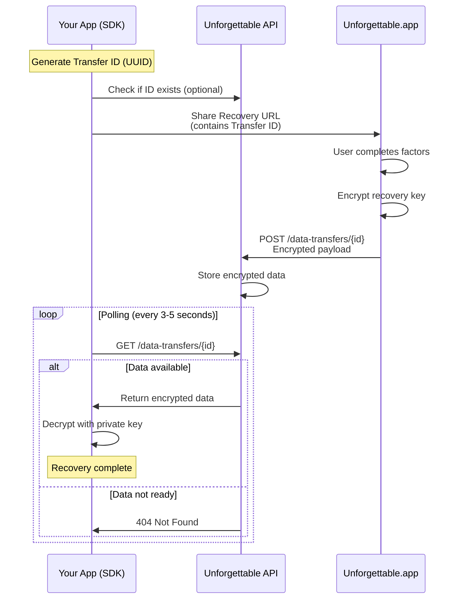

# Data Transfer

Learn how encrypted data is transferred between your application and Unforgettable.app.

## Overview

The data transfer mechanism is a temporary, encrypted messaging system that enables secure key exchange between your application and Unforgettable.app without exposing sensitive data to the API.

## Transfer Lifecycle



## Transfer ID

### Generation

The transfer ID is a UUID v4 generated by the SDK:

```typescript
import { v4 as uuid } from 'uuid'

const dataTransferId = uuid()
// Example: "550e8400-e29b-41d4-a716-446655440000"
```

**Properties:**
- **Format**: UUID v4 (RFC 4122)
- **Length**: 36 characters (32 hex + 4 hyphens)
- **Uniqueness**: ~5.3×10³⁶ possible values
- **Collision Probability**: Negligible

### Purpose

- Uniquely identifies each recovery session
- Links SDK instance to Unforgettable.app session
- Enables API to route encrypted data correctly

## API Endpoints

### Base URL

```
https://api.unforgettable.app
```

### Endpoints

#### GET /integrations/helper-keeper/v1/public/data-transfers/\{id\}

Retrieve encrypted data for a transfer.

**Request:**
```http
GET /integrations/helper-keeper/v1/public/data-transfers/550e8400-e29b-41d4-a716-446655440000
Accept: application/json
```

**Response (Success):**
```json
{
  "data": {
    "id": "550e8400-e29b-41d4-a716-446655440000",
    "data": "base64url_encoded_encrypted_payload"
  }
}
```

**Response (Not Found):**
```http
HTTP/1.1 404 Not Found
```

#### POST /integrations/helper-keeper/v1/public/data-transfers/\{id\}

Create a new data transfer (called by Unforgettable.app).

**Request:**
```http
POST /integrations/helper-keeper/v1/public/data-transfers/550e8400-e29b-41d4-a716-446655440000
Content-Type: application/json

{
  "data": "base64url_encoded_encrypted_payload"
}
```

**Response:**
```json
{
  "data": {
    "id": "550e8400-e29b-41d4-a716-446655440000",
    "data": "base64url_encoded_encrypted_payload"
  }
}
```

## Polling Strategy

### Basic Polling

```typescript
async function pollForRecoveryKey(
  sdk: UnforgettableSdk,
  interval: number = 3000,
  maxAttempts: number = 60
): Promise<string> {
  let attempts = 0
  
  while (attempts < maxAttempts) {
    try {
      const recoveryKey = await sdk.getRecoveredKey()
      return recoveryKey
    } catch (error) {
      if (error instanceof NotFoundError) {
        attempts++
        await sleep(interval)
      } else {
        throw error
      }
    }
  }
  
  throw new Error('Polling timeout')
}

const sleep = (ms: number) => new Promise(resolve => setTimeout(resolve, ms))
```

### Exponential Backoff (Advanced)

For more efficient polling with reduced server load:

```typescript
async function pollWithBackoff(
  sdk: UnforgettableSdk,
  initialInterval: number = 1000,
  maxInterval: number = 10000,
  maxAttempts: number = 60
): Promise<string> {
  let attempts = 0
  let interval = initialInterval
  
  while (attempts < maxAttempts) {
    try {
      const recoveryKey = await sdk.getRecoveredKey()
      return recoveryKey
    } catch (error) {
      if (error instanceof NotFoundError) {
        attempts++
        await sleep(interval)
        // Exponentially increase interval up to max
        interval = Math.min(interval * 1.5, maxInterval)
      } else {
        throw error
      }
    }
  }
  
  throw new Error('Polling timeout')
}
```

## Payload Structure

### Encrypted Payload

The `data` field contains a base64url-encoded encrypted JSON object:

**Before Encryption:**
```json
{
  "recovery_key": "0x1234567890abcdef...",
}
```

**After Encryption:**
```
Base64URL([ephemeral_pk][nonce][encrypted_json][auth_tag])
```

### Decryption

```typescript
// SDK handles this automatically
const { recoveryKey } = await sdk.getRecoveredData()
```

**Manual Decryption (internal):**
```typescript
const encryptedData = base64UrlToBytes(data.data)
const ephemeralPublicKey = encryptedData.slice(0, 32)
const nonce = encryptedData.slice(32, 44)
const ciphertextWithTag = encryptedData.slice(44)

const sharedSecret = x25519.getSharedSecret(privateKey, ephemeralPublicKey)
const encryptionKey = deriveKey(sharedSecret)

const cipher = chacha20poly1305(encryptionKey, nonce)
const plaintextJson = cipher.decrypt(ciphertextWithTag)

const payload = JSON.parse(bytesToString(plaintextJson))
```

## Error Handling

### HTTP Status Codes

| Code | Meaning | Action |
|------|---------|--------|
| 200 | Data available | Decrypt and return |
| 404 | Data not found | Continue polling |
| 429 | Rate limited | Back off and retry |
| 500 | Server error | Retry with backoff |
| 503 | Service unavailable | Retry later |

### SDK Error Types

```typescript
import { NotFoundError } from '@rarimo/unforgettable-sdk'

try {
  const key = await sdk.getRecoveredKey()
} catch (error) {
  if (error instanceof NotFoundError) {
    // Data not ready, continue polling
  } else if (error.name === 'NetworkError') {
    // Network issue, retry
  } else if (error.name === 'CryptoError') {
    // Decryption failed, abort
  } else {
    // Unknown error
  }
}
```

## Security Considerations

### Data Persistence

- **Temporary Storage**: Data deleted after TTL (default: 24 hours)
- **One-Time Retrieval**: Data can be retrieved multiple times (SDK limitation)
- **No Logging**: Encrypted data not logged by API

### Transport Security

- **HTTPS Only**: All API communication over TLS 1.2+
- **Certificate Pinning**: Optional for mobile apps
- **HSTS**: Enforced on API endpoints

### Rate Limiting

API implements rate limiting to prevent abuse:

- **Per IP**: 100 requests/minute
- **Per Transfer ID**: 20 requests/minute
- **Burst**: 10 requests/second

**Handling Rate Limits:**
```typescript
async function pollWithRateLimit(sdk: UnforgettableSdk) {
  try {
    return await sdk.getRecoveredKey()
  } catch (error) {
    if (error.status === 429) {
      const retryAfter = error.headers['Retry-After'] || 60
      await sleep(retryAfter * 1000)
      return pollWithRateLimit(sdk)
    }
    throw error
  }
}
```

## Performance Optimization

### Polling Interval Recommendations

| Use Case | Interval | Max Attempts |
|----------|----------|--------------|
| Interactive UI | 2-3 seconds | 60 (3 minutes) |
| Background Task | 5-10 seconds | 144 (12 minutes) |
| Low Priority | 30 seconds | 40 (20 minutes) |

### Network Efficiency

**Minimize Requests:**
```typescript
// Good: Exponential backoff
let interval = 1000
while (polling) {
  await poll()
  await sleep(interval)
  interval = Math.min(interval * 1.5, 10000)
}

// Bad: Fixed high-frequency polling
while (polling) {
  await poll()
  await sleep(500) // Too frequent!
}
```

**Connection Reuse:**
```typescript
// Configure HTTP client with keep-alive
const client = new JsonApiClient({
  baseUrl: 'https://api.unforgettable.app',
  headers: {
    'Connection': 'keep-alive',
  },
})
```

## Data Transfer Best Practices

### 1. Implement Timeout

Always set a maximum polling duration:

```typescript
const MAX_POLLING_TIME = 5 * 60 * 1000 // 5 minutes
const startTime = Date.now()

while (Date.now() - startTime < MAX_POLLING_TIME) {
  // Polling logic
}
```

### 2. User Feedback

Show polling status to users:

```typescript
let attempts = 0
while (polling) {
  updateUI(`Waiting for recovery... (${attempts}/60)`)
  await poll()
  attempts++
}
```

### 3. Graceful Degradation

Handle network failures gracefully:

```typescript
try {
  return await sdk.getRecoveredKey()
} catch (error) {
  if (isNetworkError(error)) {
    showRetryButton()
  } else {
    showErrorMessage(error)
  }
}
```

### 4. Cancel Polling

Allow users to cancel:

```typescript
const abortController = new AbortController()

cancelButton.addEventListener('click', () => {
  abortController.abort()
})

while (!abortController.signal.aborted) {
  await poll()
}
```

## Monitoring and Debugging

### Logging

Log polling attempts for debugging:

```typescript
console.log(`[Poll #${attempts}] Checking for data...`)
console.log(`Transfer ID: ${dataTransferId}`)
console.log(`Elapsed: ${Date.now() - startTime}ms`)
```

### Metrics

Track key metrics:

```typescript
const metrics = {
  totalAttempts: 0,
  successTime: 0,
  failureRate: 0,
  averageLatency: 0,
}

// Update on each poll
metrics.totalAttempts++
metrics.averageLatency = (metrics.averageLatency + latency) / 2
```

## Next Steps

- [URL Generation](/sdk/advanced/url-generation) - Recovery URL structure
- [Architecture](/sdk/advanced/architecture) - System overview
- [API Reference](/sdk/api/unforgettable-sdk) - SDK methods
