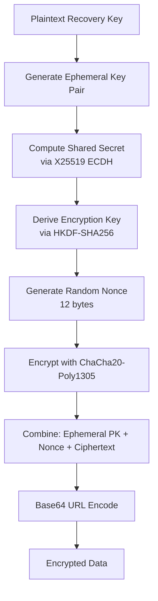
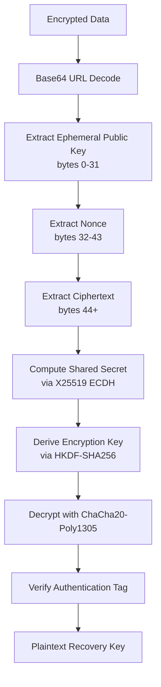

# Encryption

Deep dive into the cryptographic primitives and protocols used by Unforgettable SDK.

## Overview

The SDK uses industry-standard cryptographic algorithms to ensure end-to-end encryption of recovery keys:

- **Key Exchange**: X25519 (Curve25519 ECDH)
- **Encryption**: ChaCha20-Poly1305 AEAD
- **Key Derivation**: HKDF with SHA-256
- **Encoding**: Base64 URL-safe encoding

## Cryptographic Primitives

### X25519 Key Exchange

X25519 is a high-performance elliptic curve Diffie-Hellman (ECDH) function built on Curve25519.

**Properties:**
- **Key Size**: 32 bytes (256 bits)
- **Security Level**: ~128-bit security
- **Performance**: Fast on modern CPUs
- **Side-Channel Resistance**: Designed to resist timing attacks

**Key Generation:**

```typescript
// Generate random private key (32 bytes)
const privateKey = crypto.getRandomValues(new Uint8Array(32))

// Derive public key
const publicKey = x25519.getPublicKey(privateKey)
```

**Shared Secret Computation:**

```typescript
// Receiver's perspective
const sharedSecret = x25519.getSharedSecret(
  receiverPrivateKey,
  senderPublicKey
)

// Sender's perspective
const sharedSecret = x25519.getSharedSecret(
  senderPrivateKey,
  receiverPublicKey
)
```

### ChaCha20-Poly1305 AEAD

ChaCha20-Poly1305 is an Authenticated Encryption with Associated Data (AEAD) cipher.

**Components:**
- **ChaCha20**: Stream cipher for encryption
- **Poly1305**: MAC for authentication
- **Combined**: Provides confidentiality and authenticity

**Properties:**
- **Nonce Size**: 12 bytes (96 bits)
- **Key Size**: 32 bytes (256 bits)
- **Tag Size**: 16 bytes (128 bits)
- **Performance**: Excellent software performance

**Encryption:**

```typescript
const cipher = chacha20poly1305(encryptionKey, nonce)
const ciphertext = cipher.encrypt(plaintext)
// ciphertext includes 16-byte authentication tag
```

**Decryption:**

```typescript
const cipher = chacha20poly1305(encryptionKey, nonce)
const plaintext = cipher.decrypt(ciphertext)
// Throws if authentication fails
```

### HKDF Key Derivation

HKDF (HMAC-based Key Derivation Function) derives encryption keys from shared secrets.

**Properties:**
- **Hash Function**: SHA-256
- **Output Size**: 32 bytes (256 bits)
- **Info String**: "unforgettable-encryption"

**Derivation:**

```typescript
const encryptionKey = hkdf(
  sha256,              // Hash function
  sharedSecret,        // Input key material
  undefined,           // Salt (none)
  infoBytes,          // Context string
  32                  // Output length
)
```

## Encryption Protocol

### Data Format

Encrypted data is structured as:

```
[32 bytes ephemeral public key][12 bytes nonce][ciphertext + 16 bytes tag]
```

### Encryption Process



**Step-by-Step:**

1. **Generate Ephemeral Key Pair**
   ```typescript
   const ephemeralPrivateKey = randomBytes(32)
   const ephemeralPublicKey = x25519.getPublicKey(ephemeralPrivateKey)
   ```

2. **Compute Shared Secret**
   ```typescript
   const sharedSecret = x25519.getSharedSecret(
     ephemeralPrivateKey,
     recipientPublicKey
   )
   ```

3. **Derive Encryption Key**
   ```typescript
   const encryptionKey = hkdf(
     sha256,
     sharedSecret,
     undefined,
     stringToBytes('unforgettable-encryption'),
     32
   )
   ```

4. **Generate Nonce**
   ```typescript
   const nonce = randomBytes(12)
   ```

5. **Encrypt Data**
   ```typescript
   const cipher = chacha20poly1305(encryptionKey, nonce)
   const ciphertextWithTag = cipher.encrypt(plaintextBytes)
   ```

6. **Combine Components**
   ```typescript
   const combined = new Uint8Array([
     ...ephemeralPublicKey,  // 32 bytes
     ...nonce,               // 12 bytes
     ...ciphertextWithTag    // variable + 16 bytes tag
   ])
   ```

7. **Encode**
   ```typescript
   const encoded = bytesToBase64Url(combined)
   ```

### Decryption Process



**Step-by-Step:**

1. **Decode**
   ```typescript
   const combined = base64UrlToBytes(encryptedData)
   ```

2. **Extract Components**
   ```typescript
   const ephemeralPublicKey = combined.slice(0, 32)
   const nonce = combined.slice(32, 44)
   const ciphertextWithTag = combined.slice(44)
   ```

3. **Compute Shared Secret**
   ```typescript
   const sharedSecret = x25519.getSharedSecret(
     receiverPrivateKey,
     ephemeralPublicKey
   )
   ```

4. **Derive Encryption Key**
   ```typescript
   const encryptionKey = hkdf(
     sha256,
     sharedSecret,
     undefined,
     stringToBytes('unforgettable-encryption'),
     32
   )
   ```

5. **Decrypt and Verify**
   ```typescript
   const cipher = chacha20poly1305(encryptionKey, nonce)
   const plaintext = cipher.decrypt(ciphertextWithTag)
   // Throws error if authentication tag is invalid
   ```

## Security Properties

### Confidentiality

- **Forward Secrecy**: Each transfer uses fresh ephemeral keys
- **Quantum Resistance**: Limited (classical ECDH)
- **Key Isolation**: Private keys never transmitted

### Authentication

- **AEAD**: Poly1305 MAC prevents tampering
- **Public Key**: Embedded in URL, trusted by recipient
- **Integrity**: Any modification causes decryption failure

### Randomness

- **Nonces**: Cryptographically random, never reused
- **Keys**: Generated using platform crypto API
- **Ephemeral**: New keys for each encryption

## Implementation Details

### Random Number Generation

import Tabs from '@theme/Tabs';
import TabItem from '@theme/TabItem';

<Tabs groupId="platform">
  <TabItem value="browser" label="Browser" default>

```typescript
const randomBytes = (length: number): Uint8Array => {
  return crypto.getRandomValues(new Uint8Array(length))
}
```

  </TabItem>
  <TabItem value="nodejs" label="Node.js">

```typescript
import { randomBytes } from 'crypto'
const bytes = randomBytes(32)
```

  </TabItem>
  <TabItem value="android" label="Android">

```kotlin
import java.security.SecureRandom

val random = SecureRandom()
val bytes = ByteArray(32)
random.nextBytes(bytes)
```

  </TabItem>
  <TabItem value="ios" label="iOS">

```swift
import Security

var bytes = [UInt8](repeating: 0, count: 32)
let status = SecRandomCopyBytes(
    kSecRandomDefault,
    bytes.count,
    &bytes
)
```

  </TabItem>
</Tabs>

### Base64 URL Encoding

Standard Base64 with URL-safe modifications:

```typescript
function bytesToBase64Url(bytes: Uint8Array): string {
  const b64 = btoa(String.fromCharCode(...bytes))
  return b64
    .replace(/\+/g, '-')  // Replace + with -
    .replace(/\//g, '_')  // Replace / with _
    .replace(/=+$/, '')   // Remove padding
}

function base64UrlToBytes(base64Url: string): Uint8Array {
  let b64 = base64Url
    .replace(/-/g, '+')
    .replace(/_/g, '/')
  
  // Add padding
  while (b64.length % 4) b64 += '='
  
  const binary = atob(b64)
  return new Uint8Array(
    binary.split('').map(c => c.charCodeAt(0))
  )
}
```

## Security Considerations

### Key Management

**DO:**
- ✅ Generate fresh keys for each session
- ✅ Use platform-provided crypto APIs
- ✅ Clear keys from memory after use
- ✅ Never log private keys

**DON'T:**
- ❌ Reuse ephemeral keys
- ❌ Store private keys on disk
- ❌ Implement custom crypto
- ❌ Use weak random number generators

### Attack Resistance

**Protected Against:**
- ✅ Man-in-the-Middle (MITM)
- ✅ Replay Attacks
- ✅ Tampering
- ✅ Known-plaintext attacks

**Limitations:**
- ⚠️ Requires secure URL transmission
- ⚠️ Vulnerable if recipient device compromised
- ⚠️ No post-quantum cryptography (yet)

## Performance

### Benchmarks

Typical performance on modern hardware:

| Operation | Time | Throughput |
|-----------|------|------------|
| Key Generation | ~0.1ms | 10,000 ops/s |
| ECDH | ~0.1ms | 10,000 ops/s |
| Encryption (1KB) | ~0.05ms | 20MB/s |
| Decryption (1KB) | ~0.05ms | 20MB/s |

### Optimization Tips

1. **Batch Operations**: Generate multiple keys at once if needed
2. **Worker Threads**: Offload crypto to web workers/background threads
3. **Caching**: Cache derived keys (with caution)
4. **Platform APIs**: Use native implementations when available

## Standards Compliance

- **RFC 7748**: Elliptic Curves for Security (X25519)
- **RFC 7539**: ChaCha20 and Poly1305
- **RFC 5869**: HKDF
- **RFC 4648**: Base64 URL encoding

## Next Steps

- [Data Transfer](/sdk/advanced/data-transfer) - How encrypted data moves
- [URL Generation](/sdk/advanced/url-generation) - Recovery URL structure
- [API Reference](/sdk/api/unforgettable-sdk) - SDK methods
