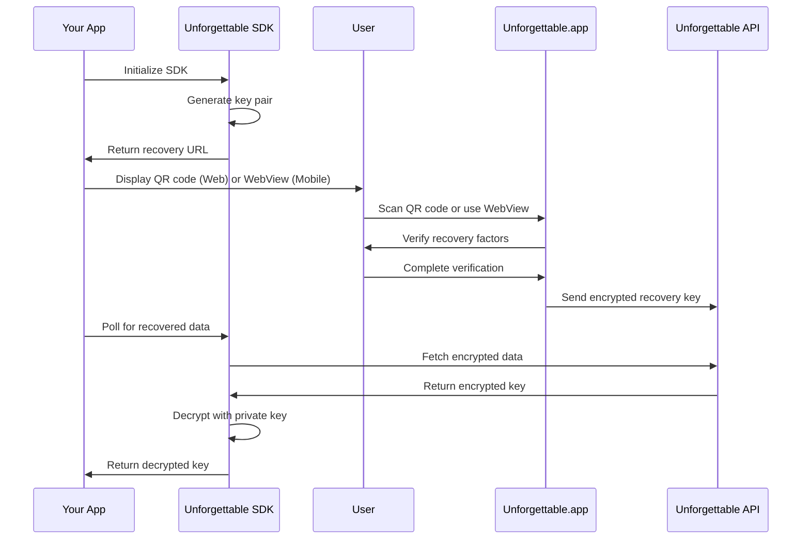

# Introduction

Welcome to the **Unforgettable SDK** documentation! This SDK provides a secure, client-side toolkit for key exchange and recovery in the [Unforgettable.app](https://unforgettable.app) ecosystem.

## What is Unforgettable SDK?

Unforgettable SDK enables you to integrate seedless login and account recovery into your applications. It allows users to recover their private keys using various recovery factors such as:

- 👤 **Face**
- 🖼️ **Physical object/Image**
- 🔑 **Password**

## Key Features

- **🔒 End-to-End Encryption**: All data is encrypted using industry-standard X25519 key exchange and ChaCha20-Poly1305 cipher
- **🌐 Cross-Platform**: Available for Web, React, React Native, Android (Kotlin), and iOS (Swift)
- **🚀 Easy Integration**: Simple APIs to generate recovery URLs and retrieve recovered keys
- **🔄 Flexible Recovery**: Support for multiple recovery factors
- **📦 Zero Dependencies on Backend**: Client-side encryption with secure key exchange
- **🎨 Customizable**: Support for custom parameters and branding

## How It Works

The Unforgettable SDK follows a simple flow:

1. **Generate Recovery URL**: Create a secure link containing your app's public encryption key
2. **User Recovery Process**: 
   - **Web**: User scans QR code to open the recovery page
   - **Mobile**: App opens the URL in a WebView for in-app recovery
3. **Retrieve Recovered Key**: Poll the API to receive the encrypted private key
4. **Decrypt & Use**: SDK automatically decrypts the key for use in your application

## Use Cases

- **Wallet Recovery**: Enable users to recover their crypto wallets without seed phrases
- **Passwordless Recovery**: Implement secure biometric recovery
- **Multi-Factor Recovery**: Combine multiple recovery factors for enhanced security
- **Social Recovery**: Allow users to recover accounts through trusted contacts
- **Enterprise Solutions**: Secure key management for organizational accounts

## Quick Start

Choose your platform to get started:

- [Web (JavaScript/TypeScript)](/sdk/platforms/web)
- [React](/sdk/platforms/react)
- [React Native](/sdk/platforms/react-native)
- [Android (Kotlin)](/sdk/platforms/android)
- [iOS (Swift)](/sdk/platforms/ios)

Or dive deeper into how the SDK works:

- [Architecture Overview](/sdk/advanced/architecture)
- [Encryption Details](/sdk/advanced/encryption)
- [API Reference](/sdk/api/unforgettable-sdk)

## Support

- **GitHub**: [rarimo/unforgettable-sdk](https://github.com/rarimo/unforgettable-sdk)
- **Website**: [unforgettable.app](https://unforgettable.app)
- **Issues**: [GitHub Issues](https://github.com/rarimo/unforgettable-sdk/issues)
